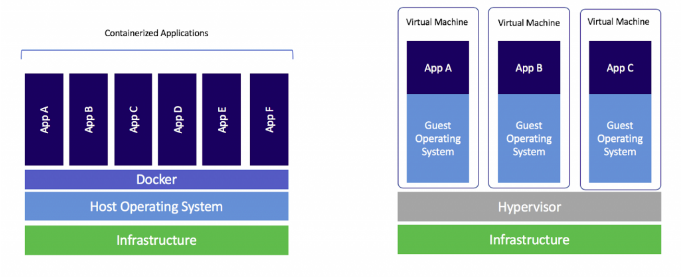
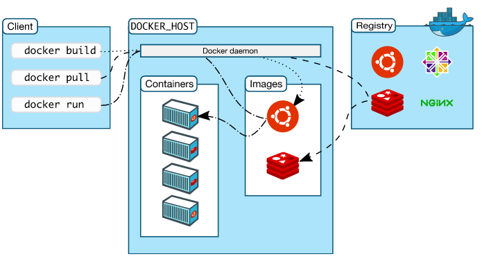
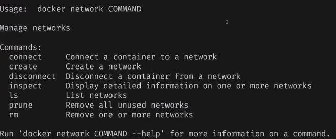
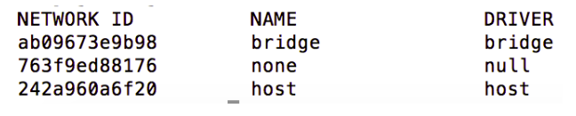

<h1 align="center">
    
</h1>

- **Overview**
    
    Um **Container** é a forma de empacotar sua aplicação e suas dependências (bibliotecas) de forma padronizada.
    <br/>
    Podemos dizer que as palavras chaves para o **Docker** são: construir, entregar e rodar em qualquer ambiente (**develop**, **ship** and **run** anywhere).
    <br/>
    - Permite rodar vários containers simultaneamente em qualquer host
    - Ele reduz tempo de build e deploy
    - Ele oferece uma maneira segura de rodar aplicações isoladas em *containers*, empacotadas com todas as suas dependências e bibliotecas.
    - Uma aplicação **dockerizada** pode ser transportada e executada em qualquer plataforma sem nenhuma modificação.
    <br/>

   
- **Container vs VM**
    
    <h1 align="center">
    
    </h1>
    
- **Imagem**
     <br/>
    A imagem é uma a definição do que vai ser um container é partir de uma imagem que você cria o container
    <br/>
    > Ela utiliza outra imagem como base para poder criar uma imagem 
    > 
    <br/>
    
- **Arquitetura Docker**
    
    <h1 align="center">
    
    </h1>
    
    O docker basicamente é formado por três elementos o **docker** **client,docker** **Daemon** e o **docker** **registry:** 
    <br/>
    - **Docker Client** – CLI ou REST API que aceita comandos do usuário e repassa estes comandos ao Docker daemon.  você vai utilizar para interagir com docker daemon.
    - **Docker Daemon** – Software que roda na máquina onde o Docker está instalado. Usuário não interage diretamente com o daemon. é ele que executa os objetos, criar os containers, cria as imagens, Networks, volumes
    - **Docker Host** – é a máquina que hospeda o docker daemon  é a máquina que roda o docker daemon
    - **Docker Registry** – É uma repositorio de imagens docker, uma coleção de imagens hospedadas e rotuladas que juntas permitem a
    criação do sistema de arquivos de um container. Um registro pode ser
    público ou privado.
    <br/>    
        
        **Outros componentes da arquitetura envolvem:**
        
    - **Docker** para Mac, Linux e Windows – versões que permitem instalar e executar containers nos sistemas operacionais de forma isolada.
    - **Docker Image** – É um template. Uma imagem contém todos os dados e metadados necessários para executar *containers* a partir de uma imagem.
    - **Docker Container** – Detém tudo que é necessário para uma aplicação ser executada. Cada *container* é criado a partir de uma imagem. Cada container é uma aplicação isolada independente.
    - **Docker Engine** – Usado para criar imagens e containers.
    - **Docker Hub** – Este é um
    registro usado para hospedar e baixar diversas imagens. Pode ser visto
    como uma plataforma SAAS de compartilhamento e gerenciamento de imagens.
    - **Dockerfile** – Um arquivo texto contendo uma sintax simples para criação de novas imagens.
    - **Docker Compose** – Usado para definir aplicações usando diversos containers.
    - **Docker Swarm** – É uma ferramenta que permite o agrupamento (*clustering*) de Containers Docker.
    <br/>

- **Executando o primeiro container(Hello-Word)**
    <br/>
    ```jsx
    //executar container apartir da imagen hello-word
    $ docker container run hello-word
    //ou (uma maneira mais antiga)
    $ docker run hello-word
    
    //executar container apartir da imagen hello-word e dar um nome 
    $ docker container run --name meucontainer hello-word
    ```
    
    - Obs: como a imagem hello-word não existe localmente na minha maquina o docker vai baixar ela da internet
<br/>

- **Listar os containers**
    <br/>
    ```jsx
    // lista todos os containers que estão em execução na minha maquina
    $ docker container ls
    //ou (uma maneira mais antiga)
    $ docker ps
    ```

    ```jsx
    // listar todos os container que não estão mais em execução na minha maquina
    docker container ls -a
    //ou (uma maneira mais antiga)
    docker ps -a
   ```
   <br/>
    
- **Remover um container**
    <br/>
    ```jsx
    // eliminar um container 
    $ docker container rm {container-id}
    //para forçar a exclusão
    $ docker conainer rm -f {container-id}
    ```
    <br/>
      
- **Dockerfile**
    </br>
    É a receita para  a criação da minha imagem,com o Dockerfile eu consigo criar a minha imagem de container, e apartir da minha imagem eu consigo criar o meu container 
    </br>
    **Criando uma imagem com o Dockerfile**
    
    1. Criar uma aplicação em node 
    2. Na raiz do projeto criar arquivo Dockerfile
    
    ```jsx
    // ----------------no arquivo Dockerfile----------------//
    
    /*
    imagem que eu vou utilizar como base para criar essa imagem
    imagem node oficial no docker hub
    */
    FROM node
    /*
    Criar o meu diretório de trabalho (no caso /app)
    WORKDIR /app é como se ele estivese fazeno mkdir/app e cd/app
    */
    WORKDIR /app
    /*
      Copia os 2 arquivos package.json e package-lock.json 
      porque os 2 arquivos tem dados referente aos pacotes do node.js
      e depois ele joga no diretorio
    */
    COPY package*.json ./
    /* 
    Comando para baixar os pacotes node_modules 
    necesarios para executar a aplicação node
    */
    RUN npm install
    /*
    Copia o restante dos arquivos necesarios para o executamento da aplicação
    codigo fonte
    */
    	COPY . . 
    /*
    	Qual porta vou expor o meu container
    */
    EXPOSE 8080
    /*
    Comando de inicialização do container
    CMD so vai ser executada na inicialização do container
    */
    CMD["node", "app.js"] // comando para inicializar a aplicação
    ```
    
    1. No **terminal** na pasta do projeto  rodar o comando de construção da imagem 
    
    ```jsx
    //------------------No Terminal(pasta src do projeto)----------------//
    
    /* 
    - docker build = Criar uma imagem 
    - -t = definir um nome para ela
    - . = Criar um contexto qual diretorio(no caso diretorio root) que eu vou enviar para docker daemon construir a imagem 
    *PADRÃO PARA CRAI NOM PARA IMAGEM
    dockerID(Name Space Do Docker HUb)/nome-do-repositorio:VersãoDaImagem
    */
    
    $ docker build -t dockerid/nomedorepositorio:v1 .
    ```
    
    1. Listar as imagens
    
    ```jsx
    //------------------No Terminal(pasta src do projeto)----------------//
    $ docker image ls
    ```
    
    1. Remover imagens que não estão sendo utilizadas 
    
    ```jsx
    //--------------------No terminal(pasta src do projeto)---------------//
    // remove as imagens que não estão sendo utilizadas,que não tem tag e não estão nomeadas
    $ docker image prune
    // remover imagem pelo image ID
    $ docker image rm dockerImageId
    ```
    
- **Upload da imagem no Docker Hub**
    1. Criar conta no [Docker Hub](https://hub.docker.com/)
    2. Logar na conta Docker Hub Usando o Comando 
    
    ```jsx
    $ docker login
    
    ------reposense(resposta esperada)
    username: 
    password:
    -- login succeeded
    
    // Deslogar da Conta 
    $ docker logout
    ```
    
    1. Push
    
    ```jsx
    $ docker push dockerid/nomedorepositorio:v1 
    ```
    
- **Tag Latest**
    1. Nomear uma nova imagem utilizando outra como base
        
        ```jsx
        $ docker tag dockerid/nomedorepositorio:v1 dcokerid/nomedorepositorio:latest
        ```
        
        ```jsx
        //Listar as Imagens
        $ docker image ls
        ```
        
    2. também  é preciso  utilizar a versão do node no arquivo dockerfile
    
    ```jsx
    // ----------------no arquivo Dockerfile----------------//
    
    /*
    imagem que eu vou utilizar como base para criar essa imagem
    imagem node oficial no docker hub
    */
    FROM node:16.13.2-slim // <------Versão do node
    /*
    Criar o meu diretório de trabalho (no caso /app)
    WORKDIR /app é como se ele estivese fazeno mkdir/app e cd/app
    */
    WORKDIR /app
    /*
    	Copia os 2 arquivos package.json e package-lock.json 
      porque os 2 arquivos tem dados referente aos pacotes do node.js
      e depois ele joga no diretorio
    */
    COPY package*.json ./
    /* 
    Comando para baixar os pacotes node_modules 
    necesarios para executar a aplicação node
    */
    RUN npm install
    /*
    Copia o restante dos arquivos necesarios para o executamento da aplicação
    codigo fonte
    */
    	COPY . . 
    /*
    	Qual porta vou expor o meu container
    */
    EXPOSE 8080
    /*
    Comando de inicialização do container
    CMD so vai ser executada na inicialização do container
    */
    CMD["node", "app.js"] // comando para inicializar a aplicação
    ```
    
    1. Fazer a reconstrução da imagem v1
    
    ```jsx
    $ docker build -t dockerid/nomedorepositorio:v1
    ```
    
    1. Push no Docker Hub
    
    ```jsx
    $ docker push dockerid/nomedorepositorio:v1
    ```
    
    1. Fazer a reconstrução da imagem latest
    
    ```jsx
    $ docker build -t dockerid/nomedorepositorio:latest
    ```
    
    1. push da latest
    
    ```jsx
    $ docker push dockerid/nomedorepositorio:latest
    ```
    
- **Limpar Todos os containers e imagens**
    
    ```jsx
    $ docker_clear
    ```
    
- **docker inspect**
    
    Comando que retorna detalhes sobre o container
    
    ```jsx
    $ docker inspect containerid
    ```
    
- **Redes padrões do Docker**
    <br/>
    **Instruções de rede**
    
    ```jsx
        $ docker network
    ```
    O retorno será:
    
    <h1 align="center">
    
    </h1>

    O docker é disponibilizado com **três redes por padrão**. Essas redes oferecem configurações específicas para gerenciamento do tráfego de dados. Para visualizar essas interfaces, basta utilizar o comando abaixo:
    
    ```jsx
    $docker network ls
    ```
   
    O retorno será:
    
     <h1 align="center">
    
    </h1>
    
    - **Bridge**
    
      Nessa rede é possível expor portas dos containers para todos os ativos com acesso ao docker host.
    <br/>
    - **Host**
    
    ele vai conectar o container na sua placa de rede na sua rede local ele vai e vai funcionar como se fizesse parte da sua rede 
    <br/>
    - **Overlay (Muito Utilizado quando estiver trabalhando com docker swarm)**
    
    ele é utilizado para conectar vários containers de vários servidores
    <br/>
    - **macvlan**
    
    que simula ali uma o endereço MAC em uma placa de rede para você utilizar no seu container
    <br/>
- **Docker Compose**
    
    É uma ferramenta para definição e execução de múltiplos containers Docker. Com ela é possível configurar todos os parâmetros necessários para executar cada container a partir de um **arquivo de definição**. Dentro desse arquivo, definimos cada container como **serviço**, ou seja, sempre que esse texto citar **serviço** de agora em diante, imagine que é a definição que será usada para iniciar um **container**, tal como portas expostas, variáveis de ambiente e afins.
    <br/>
    Com o Docker Compose podemos também especificar quais **volumes** e **rede** serão criados para serem utilizados nos parâmetros dos **serviços**, ou seja, isso quer dizer que não preciso criá-los manualmente para que os **serviços** utilizem recursos adicionais de **rede** e **volume**.
    <br/>
    O **arquivo de definição** do Docker Compose é o local onde é especificado todo o ambiente (**rede**, **volume** e **serviços**), ele é escrito seguindo o formato [YAML](https://pt.wikipedia.org/wiki/YAML). Esse arquivo por padrão tem como nome [docker-compose.yml](https://docs.docker.com/compose/compose-file/).
    
    - **docker-compose.yml**
</br>
### Links Para Referência:
- [Documentação](https://docs.docker.com/)
- [Docker Hub](https://hub.docker.com/)
- [Geekhunter](https://blog.geekhunter.com.br/docker-na-pratica-como-construir-uma-aplicacao/)
- [Intensivão de Docker-Parte 01](https://youtu.be/xXMQRs-xZi4)
- [Intensivão de Docker: Parte 02](https://youtu.be/Z4fMBfGb-5c)
- [Stack Desenvolvedor Expert](https://stack.desenvolvedor.expert/appendix/docker/rede.html)

